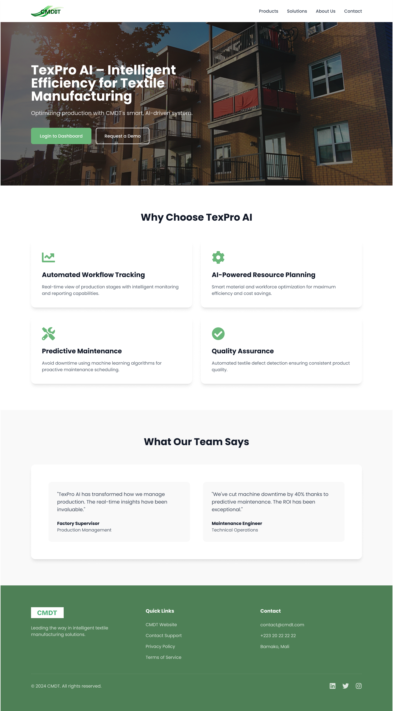

# TexPro AI - Textile Manufacturing Management System



A comprehensive full-stack web application for textile manufacturing management, featuring AI-powered quality control, predictive maintenance, and real-time production monitoring.

## 🌟 Features

### 🔐 Role-Based Access Control
- **Admin**: Complete system management and user administration
- **Supervisor**: Production oversight and resource allocation
- **Inspector**: Quality control and inspection workflows
- **Technician**: Machine maintenance and repair tasks
- **Analyst**: Data analysis and reporting

### 🏭 Core Modules

#### 📊 **Machine Management**
- Real-time machine monitoring
- Performance analytics and KPIs
- Predictive maintenance scheduling
- Equipment lifecycle tracking
- Downtime analysis and optimization

#### 🔍 **Quality Control**
- AI-powered defect detection
- Interactive inspection workflows
- Camera-based quality checks
- Standards and template management
- Compliance tracking and reporting

#### 🔧 **Maintenance System**
- Preventive maintenance scheduling
- Work order management
- Spare parts inventory tracking
- Maintenance history and analytics
- Predictive failure analysis

#### 📈 **Analytics & Reporting**
- Real-time production dashboards
- Custom report generation
- Export capabilities (CSV, Excel, PDF)
- Trend analysis and forecasting
- Performance benchmarking

#### 🔔 **Notification System**
- Real-time alerts and notifications
- Customizable notification preferences
- Email and in-app notifications
- Priority-based alert routing
- Notification history tracking

#### 🏗️ **Workflow Management**
- Production batch tracking
- Process optimization
- Resource allocation
- Bottleneck identification
- Efficiency monitoring

## 🛠️ Technology Stack

### Backend
- **Framework**: Django 4.2+ with Django REST Framework
- **Database**: SQLite (development) / PostgreSQL (production)
- **Authentication**: JWT-based authentication
- **API**: RESTful API with comprehensive documentation
- **AI/ML**: Integrated quality detection algorithms

### Frontend
- **Framework**: Next.js 15 with TypeScript
- **Styling**: Tailwind CSS
- **UI Components**: Custom component library
- **Charts**: Interactive data visualizations
- **Camera**: MediaDevices API for quality inspections
- **State Management**: React Context API

## 🚀 Quick Start

### Prerequisites
- Python 3.9+
- Node.js 18+
- npm or yarn
- Git

### Backend Setup

1. **Clone the repository**
   ```bash
   git clone https://github.com/yourusername/TextProBah.git
   cd TextProBah/backend
   ```

2. **Create virtual environment**
   ```bash
   python -m venv venv
   # Windows
   venv\Scripts\activate
   # Linux/Mac
   source venv/bin/activate
   ```

3. **Install dependencies**
   ```bash
   pip install -r requirements.txt
   ```

4. **Environment setup**
   ```bash
   cp .env.template .env
   # Edit .env with your configuration
   ```

5. **Database setup**
   ```bash
   python manage.py makemigrations
   python manage.py migrate
   python manage.py createsuperuser
   ```

6. **Load sample data (optional)**
   ```bash
   python manage.py loaddata fixtures/demo_quick_users.json
   python manage.py loaddata fixtures/demo_quick_machines.json
   python manage.py loaddata fixtures/demo_quick_maintenance_logs.json
   ```

7. **Run development server**
   ```bash
   python manage.py runserver
   ```

### Frontend Setup

1. **Navigate to frontend directory**
   ```bash
   cd ../frontend
   ```

2. **Install dependencies**
   ```bash
   npm install
   # or
   yarn install
   ```

3. **Environment setup**
   ```bash
   # Create .env.local file
   echo "NEXT_PUBLIC_API_URL=http://localhost:8000/api" > .env.local
   ```

4. **Run development server**
   ```bash
   npm run dev
   # or
   yarn dev
   ```

5. **Access the application**
   - Frontend: http://localhost:3000
   - Backend API: http://localhost:8000/api
   - Admin Panel: http://localhost:8000/admin

## 📱 User Interfaces

### Inspector Dashboard
- Quality metrics overview
- Machine status monitoring
- Inspection scheduling
- Defect tracking and analysis
- Camera-based quality checks

### Admin Dashboard
- User management
- System configuration
- Analytics overview
- Report generation
- Audit trails

### Supervisor Dashboard
- Production monitoring
- Resource allocation
- Team management
- Performance tracking
- Workflow optimization

### Technician Dashboard
- Maintenance tasks
- Machine diagnostics
- Work order tracking
- Spare parts management
- Repair history

## 🔧 Configuration

### Environment Variables

#### Backend (.env)
```env
DEBUG=True
SECRET_KEY=your-secret-key
DATABASE_URL=sqlite:///db.sqlite3
ALLOWED_HOSTS=localhost,127.0.0.1
EMAIL_BACKEND=django.core.mail.backends.console.EmailBackend
```

#### Frontend (.env.local)
```env
NEXT_PUBLIC_API_URL=http://localhost:8000/api
NEXT_PUBLIC_APP_NAME=TexPro AI
NEXT_PUBLIC_VERSION=1.0.0
```

## 📊 Sample Data

The system includes multiple fixture sets for different scenarios:

- **demo_quick**: Quick demo setup with minimal data
- **interview_ready**: Comprehensive data for demonstrations
- **portfolio_showcase**: Rich dataset for portfolio presentation
- **presentation_full**: Complete dataset for full presentations

Load any fixture set:
```bash
python manage.py loaddata fixtures/[fixture_name]_users.json
python manage.py loaddata fixtures/[fixture_name]_machines.json
python manage.py loaddata fixtures/[fixture_name]_maintenance_logs.json
```

## 🧪 Testing

### Backend Tests
```bash
cd backend
python manage.py test
```

### Frontend Tests
```bash
cd frontend
npm test
# or
yarn test
```

### API Testing
Use the provided test scripts:
```bash
cd backend
python test_api.py
python test_analytics.py
python test_workflow_api.py
```

## 📚 API Documentation

### Authentication
```http
POST /api/users/auth/login/
POST /api/users/auth/logout/
POST /api/users/auth/refresh/
```

### Machine Management
```http
GET    /api/machines/machines/
POST   /api/machines/machines/
GET    /api/machines/machines/{id}/
PUT    /api/machines/machines/{id}/
DELETE /api/machines/machines/{id}/
```

### Quality Control
```http
GET  /api/quality/checks/
POST /api/quality/checks/
GET  /api/quality/standards/
POST /api/quality/standards/
```

### Maintenance
```http
GET  /api/maintenance/logs/
POST /api/maintenance/logs/
GET  /api/maintenance/schedules/
```

For complete API documentation, visit `/api/docs/` when running the development server.

## 🎨 UI Components

### Key Components
- **SimpleChart**: Interactive charts for data visualization
- **Card**: Flexible card layouts for content
- **Button**: Consistent button styling and variants
- **Badge**: Status indicators and labels
- **ProgressBar**: Visual progress indicators
- **Table**: Data tables with sorting and filtering

### Navigation
- **InspectorSidebar**: Quality control navigation
- **AdminSidebar**: Administrative functions
- **SupervisorSidebar**: Production management
- **TechnicianSidebar**: Maintenance tasks

## 🔍 Quality Control Features

### Camera Inspection
- Live camera feed integration
- Image capture and storage
- Grid overlay for precise measurements
- Flash control (where supported)
- Multiple image capture per inspection

### AI-Powered Analysis
- Defect detection algorithms
- Pattern recognition
- Automated quality scoring
- Trend analysis and predictions
- Compliance verification

### Inspection Workflows
- Template-based inspections
- Standard operating procedures
- Digital signature capture
- Real-time collaboration
- Audit trail maintenance

## 📈 Analytics & Insights

### Real-Time Dashboards
- Machine performance metrics
- Quality trend analysis
- Production efficiency tracking
- Resource utilization monitoring
- Predictive maintenance indicators

### Custom Reports
- Flexible report builder
- Scheduled report generation
- Multi-format exports
- Automated distribution
- Historical comparisons

## 🔧 Maintenance Features

### Predictive Maintenance
- AI-powered failure prediction
- Optimal maintenance scheduling
- Cost optimization algorithms
- Performance trend analysis
- Resource planning tools

### Work Order Management
- Digital work orders
- Task assignment and tracking
- Parts inventory integration
- Time tracking and costing
- Completion verification

## 🚀 Deployment

### Production Checklist
- [ ] Set `DEBUG=False` in backend
- [ ] Configure production database
- [ ] Set up static file serving
- [ ] Configure email backend
- [ ] Set up SSL certificates
- [ ] Configure backup strategy

### Docker Deployment
```bash
# Build and run with Docker Compose
docker-compose up -d
```

### Cloud Deployment
The application supports deployment on:
- AWS (EC2, RDS, S3)
- Google Cloud Platform
- Microsoft Azure
- DigitalOcean
- Heroku

## 🤝 Contributing

1. Fork the repository
2. Create a feature branch (`git checkout -b feature/AmazingFeature`)
3. Commit your changes (`git commit -m 'Add some AmazingFeature'`)
4. Push to the branch (`git push origin feature/AmazingFeature`)
5. Open a Pull Request

## 📄 License

This project is licensed under the MIT License - see the [LICENSE](LICENSE) file for details.

## 👥 Authors

- **Your Name** - *Initial work* - [YourGitHub](https://github.com/yourusername)

## 🙏 Acknowledgments

- Django and Django REST Framework communities
- Next.js and React communities
- Tailwind CSS team
- All contributors and testers

## 📞 Support

For support, email support@texpro.ai or join our Slack channel.

## 🗺️ Roadmap

### Version 2.0 (Planned)
- [ ] Advanced AI/ML models
- [ ] Mobile application
- [ ] IoT sensor integration
- [ ] Advanced analytics
- [ ] Multi-tenant support
- [ ] API rate limiting
- [ ] Real-time notifications via WebSocket
- [ ] Advanced role permissions
- [ ] Integration with ERP systems
- [ ] Blockchain-based audit trails

---

**TexPro AI** - Revolutionizing textile manufacturing through intelligent automation and data-driven insights.
